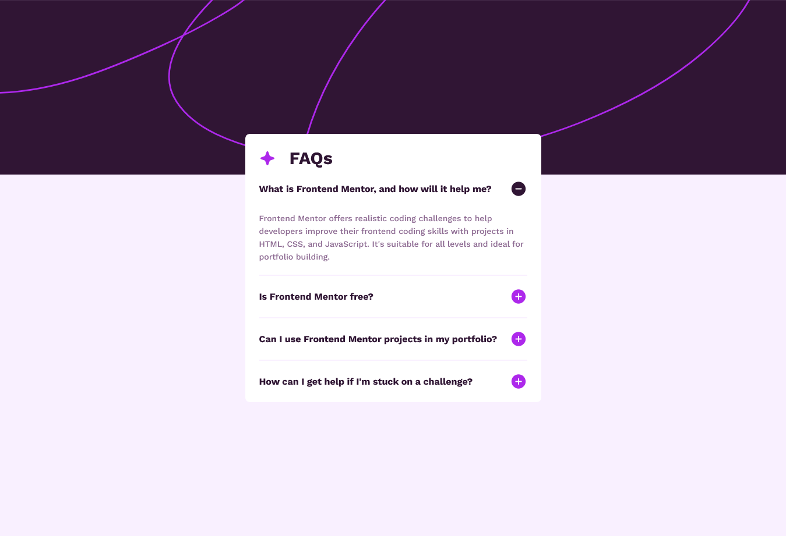

# FAQ accordion solution

## Table of contents

- [Overview](#overview)
  - [The challenge](#the-challenge)
  - [Screenshot](#screenshot)
  - [Links](#links)
- [My process](#my-process)
  - [Built with](#built-with)
- [Author](#author)

## Overview

### The challenge

Users should be able to:

- Hide/Show the answer to a question when the question is clicked
- Navigate the questions and hide/show answers using keyboard navigation alone
- View the optimal layout for the interface depending on their device's screen size
- See hover and focus states for all interactive elements on the page

### Screenshot

### Links

- Solution URL: [https://www.frontendmentor.io/solutions/faq-accordion-l0vIIRtSl5](https://www.frontendmentor.io/solutions/faq-accordion-l0vIIRtSl5)
- Live Site URL: [https://faq-accordion-guzmanpdro.netlify.app/](https://faq-accordion-guzmanpdro.netlify.app/)

## My process

### Built with

- Semantic HTML5 markup
- CSS custom properties
- Flexbox
- Mobile-first workflow

## Author

- Website - [https://guzmanpdro.vercel.app/](https://guzmanpdro.vercel.app/)
- Frontend Mentor - [@guzmanpdro](https://www.frontendmentor.io/profile/guzmanpdro)
- Twitter - [@guzmanpdro](https://www.x.com/guzmanpdro)
